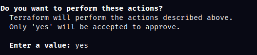
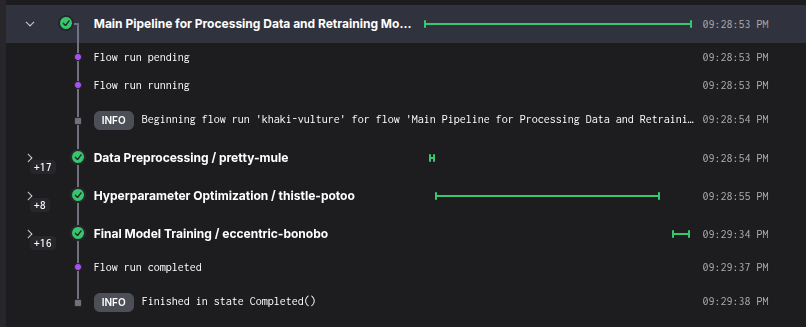

<h1 align="center">
    <strong>Loan Prediction: Automating Loan Eligibility with MLOps</strong>
</h1>

## Introduction

This project is the capstone for the [MLOps Zoomcamp](https://github.com/DataTalksClub/mlops-zoomcamp) by DataTalks.Club. It applies MLOps principles to a real-world classification problem: predicting loan eligibility.

We'll be using a dataset from [Kaggle](https://www.kaggle.com/datasets/altruist/loan-prediction-problem-dataset). Preliminary data analysis, which guided the development process, can be found in the `notebooks/` directory.

This project implements the complete machine learning lifecycle, leveraging Terraform for infrastructure provisioning, MLflow for modeling and experiment tracking, Prefect for workflow orchestration, and deployment via Docker, AWS Lambda, and Kinesis. Best practices are followed throughout, including integration testing with LocalStack, unit testing, code linting and formatting with ruff, and workflow automation using Makefile.


## Project Context & Problem Statement

Financial institutions face the challenge of evaluating loan applications quickly, fairly, and at scale. Human review is essential for nuanced decision-making, but manual processes are slow, costly, and subject to bias or inconsistency. In a competitive market, organizations need tools that can provide objective, data-driven insights to support and enhance the decision process.

This project delivers a machine learning solution that predicts loan eligibility based on applicant data—such as income, credit history, and demographic factors. The model is designed not as a replacement for human expertise, but as a **decision-support tool**: its predictions can be used as an input to broader workflows, other models, or as a factor in human review. By integrating this model, lenders can:

- Accelerate initial screening and triage
- Reduce manual workload for routine cases
- Improve consistency and transparency in decision-making
- Enable scalable, real-time risk assessment

The output of this system is intended to be consumed by downstream processes—whether automated or human—helping organizations make better, faster, and more consistent lending decisions.


## Tech Stack
* **Python**
* **Terraform**: Infrastructure as Code.
* **AWS** (Kinesis, S3, EC2, ECR, Lambda): Services for development and streaming inference.
* **Docker**: Containerization
* **uv**: Dependency management
* **Prefect**: Workflow orchestration
* **MLflow**: Experiment tracking & model registry
* **ruff**: Linter & code formatter
* **LocalStack**: Test cloud services

## Good practices
- [x] Unit tests using Pytest
- [x] Integration tests using LocalStack for cloud services
- [x] Linter and code formatter using ruff
- [x] Makefile to automate building and managing dependencies
- [x] IaC with Terraform

## Project Organization

```
loan_prediction/    
├── LICENSE            <- Open-source license if one is chosen
├── Makefile           <- Makefile with convenience commands like `make data` or `make train`
├── README.md          <- The top-level README for developers using this project.
├── data
│   ├── external       <- Data from third party sources.
│   ├── interim        <- Intermediate data that has been transformed.
│   ├── processed      <- The final, canonical data sets for modeling.
│   └── raw            <- The original, immutable data dump.
│
├── models             <- Trained and serialized models, model predictions, or model summaries
│
├── notebooks          <- Jupyter notebooks for visualizations and toy tests.
│
├── infrastructure     <- Terraform IaC setup.
│
├── pyproject.toml     <- Project configuration file with package metadata for 
│                         lap (src module) and configuration for tools like black
│
├── reports            <- Generated analysis as HTML, PDF, LaTeX, etc.
│   └── figures        <- Generated graphics and figures to be used in reporting
│
│
└── lap   <- Source code for use in this project.
    │
    ├── __init__.py             <- Makes lap a Python module
    │
    ├── config.py               <- Store useful variables and configuration
    │
    ├── dataset.py              <- Script to create the processed dataset
    │
    └── modeling                
        ├── __init__.py 
        ├── hp_optim.py         <- Code to make hyperparameter optimization of specific model
        ├── model_selection.py  <- Code to test several models and select the best 
        ├── predict.py          <- Code to run model inference with trained models          
        └── train.py            <- Code to train models
```

--------

## Requirements

Before setting up the whole project you need to have installed:
* [Docker](https://docs.docker.com/desktop/): Including `docker compose` command
* Make
* [uv](https://docs.astral.sh/uv/getting-started/installation/) Package Manager
* [AWS CLI](https://docs.aws.amazon.com/cli/latest/userguide/getting-started-install.html): Use `aws configure` to set up your IAM credentials.
* [Terraform](https://developer.hashicorp.com/terraform/install) for Infrastructure as Code

## Project Setup

Clone the project from the repository and move to its directory.

```bash
git clone https://github.com/Gustavo-HA/loan_prediction.git
cd loan_prediction
```

Create the environment.

```bash
make create_environment
```

Activate it using the command for your OS

```bash
# Linux/MacOS
source ./venv/bin/activate

# Windows
.\venv\bin\activate
```

Sign into your Prefect account using `uvx prefect-cloud login` and follow instructions.

Create, clean and preprocess the dataset using:

```bash
make data
```

### Cloud Infrastructure

Before doing any training, we must track the experiments with MLflow. We'll be using AWS for the cloud services and Terraform to create the S3 bucket and the online service with Kinesis and Lambda. This is a tricky part and may need to change some variables to work the best in your device, here are some easy steps to ensure its functionality:
* Create a S3 bucket to store the tfstate
* Go to `infrastructure/main.tf` and adjust this code section to your s3 bucket
```hcl
terraform {
    required_version = ">= 1.0.0"
    backend "s3" {
        bucket = "tf-state-loan-prediction"
        key = "loan-prediction.tfstate"
        region = "us-east-2"
        encrypt = true
    }
}
```
* Similarly, update the aws region and the S3 bucket variable in `infrastructure/vars/stg.tfvars` to ensure the bucket name is globally unique. For more information, see the [AWS S3 bucket naming rules](https://docs.aws.amazon.com/AmazonS3/latest/userguide/bucketnamingrules.html).

 We can instantiate the services using

```bash
make aws_services
```

It then will ask you permission to run the services, type "yes" and hit enter.

<p align="center">
    
</p>

If you want to set an online tracking server you need to manually create an EC2 instance, set boundary rules to the S3 bucket to store the model artifacts and run the following command in the terminal (This will also require you to configure a .env file with the variable `MLFLOW_TRACKING_SERVER`). Otherwise, you could do it locally; open a new terminal, activate the environment and run.

```bash
mlflow server -h 0.0.0.0 -p 5000 --backend-store-uri sqlite:///mlflow.db --default-artifact-root s3://stg-mlflow-models-loan-prediction
```
Now that you have the tracking server running, you can proceed to train several models, perform hyperparameter optimization on the best algorithm and train the final model with

```bash
make data_train_pipeline 
```

You could also verify the whole pipeline orchestration with [Prefect Cloud](https://app.prefect.cloud/) in Runs.

<p align="center">
    
</p>


Now that we have the model that we'll be using for inference, it's time to mount it to the lambda function. The way we'll do this is by defining environment variables within the lambda function, so that it can succesfully call the correct model. The way we do this is by running a [manual script](./scripts/deploy-manual.sh) which will set the `EXPERIMENT_ID` and `MODEL_ID` env variables to point to the latest model created within our s3 bucket (at this point, it corresponds to the final model). We can do it via

```bash
make set_env_vars
```
You should see a confirmation message with the Lambda function details. Ensure the environment variables are set correctly before proceeding to inference tests.

At this point we have succesfully deployed the model and is completely ready for inference. We can test the functionality with the `put-record` kinesis API to insert a record into the input stream and look for the prediction in the output stream using the `get-record` API. This is also done with a [script](./scripts/test-cloud-e2e.sh), we can execute it with

```bash
make test_online_inference
```

After running, you should see a SHARD_ID and a list of records in the output stream. Each record contains a prediction result encoded in base64. Successful output confirms that the end-to-end inference pipeline is working as expected.

> [!NOTE]
> Records may take some time to appear. This is because of Lambda cold starts or deployment lag. Just try waiting ~30 seconds to run the command again.

---


> [!WARNING]
> Once you have finished testing or using the project, make sure to clean up all AWS resources to avoid unnecessary costs. You can do this by running `make aws_destroy`. This command will prompt you for confirmation; type "yes" when asked by Terraform to proceed with the deletion of all Amazon services created for this project.

### Tests

You can directly run both unit tests and integration tests using

```bash
make test
```

If you want to run them separately you coud do

```bash
# For unit tests
make unit-tests

# For integration-tests
make integration-tests
```