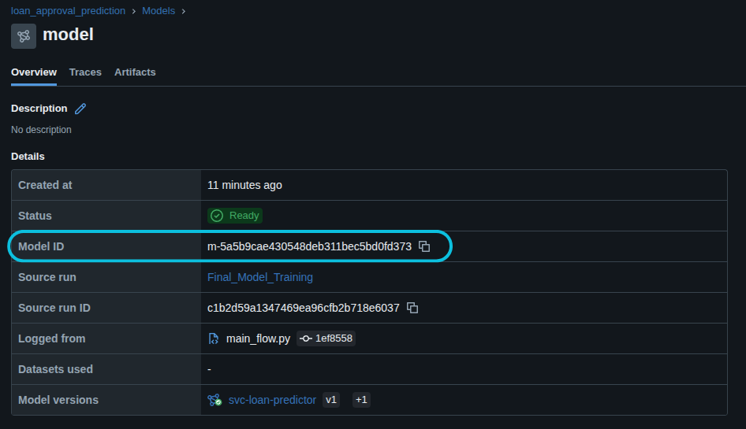

<h1 align="center">
    <strong>Loan Prediction - Automating Loan Eligibility - MLOps</strong>
</h1>

<a target="_blank" href="https://cookiecutter-data-science.drivendata.org/">
    
</a>

This project serves as the capstone for the [MLOps Zoomcamp](https://github.com/DataTalksClub/mlops-zoomcamp) by DataTalks.Club. It applies the MLOps principles learned throughout the course to a real-world classification problem.

The task is to predict loan eligibility using a dataset from [Kaggle](https://www.kaggle.com/datasets/altruist/loan-prediction-problem-dataset). Preliminary data analysis, which guided the development process, can be found in the `notebooks/` directory.

## Task Description

### The Challenge
Manually reviewing loan applications is **slow, expensive, and can lead to inconsistent decisions**. The core challenge is to replace this subjective process with a fast, data-driven system to accurately assess an applicant's eligibility in **real time**.

### The Solution
This project builds a ML classification model to automate the loan eligibility process. Using applicant details like income, credit history, and marital status, the model provides instant recommendations. The goal is to increase efficiency, reduce human bias, and create a scalable system for real-time loan approval.

### MLOps Focus
A successful model requires more than just accurate predictions. This project incorporates **MLOps practices** to ensure the entire system is robust, scalable, and maintainable, making it suitable for a real-world, production environment.


## Tech Stack
* **Python**
* **Terraform**: Infrastructure as Code.
* **AWS** (Kinesis, S3, EC2, ECR, Lambda): Services for development and streaming inference.
* **Docker**: Containerization
* **uv**: Dependency management
* **Prefect**: Workflow orchestration
* **MLflow**: Experiment tracking & model registry
* **ruff**: Linter & code formatter
* **Evidently**: Model monitoring

## Project Organization

```
loan_prediction/    
├── LICENSE            <- Open-source license if one is chosen
├── Makefile           <- Makefile with convenience commands like `make data` or `make train`
├── README.md          <- The top-level README for developers using this project.
├── data
│   ├── external       <- Data from third party sources.
│   ├── interim        <- Intermediate data that has been transformed.
│   ├── processed      <- The final, canonical data sets for modeling.
│   └── raw            <- The original, immutable data dump.
│
├── models             <- Trained and serialized models, model predictions, or model summaries
│
├── notebooks          <- Jupyter notebooks for visualizations and toy tests.
│
├── infrastructure     <- Terraform IaC setup.
│
├── pyproject.toml     <- Project configuration file with package metadata for 
│                         lap (src module) and configuration for tools like black
│
├── reports            <- Generated analysis as HTML, PDF, LaTeX, etc.
│   └── figures        <- Generated graphics and figures to be used in reporting
│
├── requirements.txt   <- The requirements file for reproducing the analysis environment, e.g.
│                         generated with `pip freeze > requirements.txt`
│
└── lap   <- Source code for use in this project.
    │
    ├── __init__.py             <- Makes lap a Python module
    │
    ├── config.py               <- Store useful variables and configuration
    │
    ├── dataset.py              <- Script to create the processed dataset
    │
    └── modeling                
        ├── __init__.py 
        ├── hp_optim.py         <- Code to make hyperparameter optimization of specific model
        ├── model_selection.py  <- Code to test several models and select the best 
        ├── predict.py          <- Code to run model inference with trained models          
        └── train.py            <- Code to train models
```

--------

## Requirements

Before setting up the whole project you need to have installed:
* [Docker](https://docs.docker.com/desktop/)
* Make
* [uv](https://docs.astral.sh/uv/getting-started/installation/) Package Manager
* [AWS CLI](https://docs.aws.amazon.com/cli/latest/userguide/getting-started-install.html): Use `aws configure` to set up your IAM credentials.
* [Terraform](https://developer.hashicorp.com/terraform/install) for Infrastructure as Code

## Project Setup

Clone the project from the repository and move to its directory.

```bash
git clone https://github.com/Gustavo-HA/loan_prediction.git
cd loan_prediction
```

Create the environment.

```bash
make create_environment
```

Activate it using the command for your OS

```bash
# Linux/MacOS
source ./venv/bin/activate

# Windows
.\venv\bin\activate
```

Create, clean and preprocess the dataset using:

```bash
make data
```

### Cloud Infrastructure

Before doing any training, we must track the experiments with MLflow. We'll be using AWS for the cloud services and Terraform to create the S3 bucket and the online service with Kinesis and Lambda. This is a tricky part and may need to change some variables to work the best in your device, here are some easy steps to ensure its functionality:
* Create a S3 bucket to store the tfstate
* Go to `infrastructure/main.tf` and adjust this code section to your s3 bucket
```hcl
terraform {
    required_version = ">= 1.0.0"
    backend "s3" {
        bucket = "tf-state-loan-prediction"
        key = "loan-prediction.tfstate"
        region = "us-east-2"
        encrypt = true
    }
}
```
* Similarly, update the aws region and the S3 bucket variable in `infrastructure/vars/stg.tfvars` to ensure the bucket name is globally unique. For more information, see the [AWS S3 bucket naming rules](https://docs.aws.amazon.com/AmazonS3/latest/userguide/bucketnamingrules.html).

 We can instantiate the services using

```bash
make aws_services
```

It then will ask you permission to run the services, type "yes" and hit enter.

<p align="center">
    
</p>

If you want to set an online tracking server you need to manually create an EC2 instance, set boundary rules to the S3 bucket to store the model artifacts and run the following command in the terminal. Otherwise, you could do it locally; open a new terminal, activate the environment and run.

```bash
mlflow server -h 0.0.0.0 -p 5000 --backend-store-uri sqlite:///mlflow.db --default-artifact-root s3://<MODEL-S3-BUCKET>
```
Now that you have the tracking server running, you can proceed to train several models, perform hyperparameter optimization on the best algorithm and train the final model with

```bash
make data_train_pipeline 
```

This previous command will also put the final model in the Mlflow's Model Registry (Locally on [http://localhost:5000/#/experiments/1/models](http://localhost:5000/#/experiments/1/models)). From there, one is able to retrieve the model id 

<p align="center">
    
</p>


